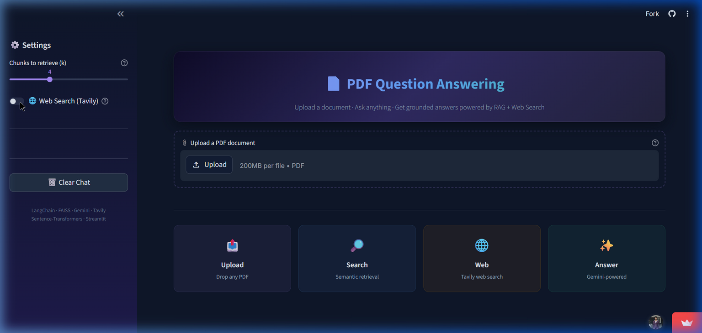

<div align="center">

# 📄 PDF RAG — Intelligent Document Q&A System

### *Ask your documents anything. Get grounded, hallucination-free answers.*

[](https://pdf-rag-system-cvpgps4pkqshqrtvmqgrl4.streamlit.app/)
[](https://python.org)
[](LICENSE)


<br>



<br><br>

<a href="https://pdf-rag-system-cvpgps4pkqshqrtvmqgrl4.streamlit.app/">
  
</a>

<br>

</div>

---

## 🧠 What Is This?

A production-ready **Retrieval-Augmented Generation (RAG)** pipeline that lets users upload any PDF and have an intelligent conversation about its contents. Rather than sending an entire document to an LLM (which is expensive, slow, and leads to hallucination), this system:

1. **Chunks** the document into semantically meaningful passages
2. **Embeds** each chunk into a high-dimensional vector space
3. **Retrieves** only the most relevant chunks for a given question
4. **Generates** a grounded answer using Google Gemini — citing only what the document actually says

The result? **Accurate, fast, and cost-effective** document understanding — with optional **live web search** to fill knowledge gaps.

---

## ✨ Key Features

| Feature | Description |
|:---|:---|
| 📤 **PDF Upload & Parsing** | Drag-and-drop any PDF up to 200 MB. Automatic text extraction via PyPDFLoader |
| 🧮 **Semantic Embeddings** | Sentence-level embeddings using `all-MiniLM-L6-v2` (384-dim, fast & accurate) |
| 📦 **FAISS Vector Store** | Facebook AI's billion-scale similarity search — runs locally, no external DB needed |
| 🤖 **Gemini 2.5 Flash** | Google's latest LLM for fast, grounded generation with reduced hallucination |
| 🌐 **Tavily Web Search** | Optional real-time web search to supplement document knowledge |
| 💬 **Conversational Memory** | Multi-turn context — ask follow-ups like "Tell me more about that" |
| 📚 **Source Citations** | Expandable source panel showing exactly which PDF page & web URL backed each answer |
| ⚡ **Smart Caching** | `@st.cache_resource` ensures PDFs are processed once — subsequent queries are instant |
| 🎨 **Dark Theme UI** | Polished, responsive interface with gradient accents, feature cards & custom CSS |

---

## 🏗️ Architecture

```
┌─────────────────────────────────────────────────────────┐
│                      User Interface                      │
│                    (Streamlit App)                        │
└──────────┬──────────────────────────────┬────────────────┘
           │                              │
     ┌─────▼──────┐               ┌──────▼───────┐
     │  PDF Upload │               │ Chat Input   │
     └─────┬──────┘               └──────┬───────┘
           │                              │
     ┌─────▼──────────────┐        ┌──────▼───────────────┐
     │ PyPDFLoader         │        │ Conversation Memory  │
     │ → Text Extraction   │        │ (Last 6 messages)    │
     └─────┬──────────────┘        └──────┬───────────────┘
           │                              │
     ┌─────▼──────────────┐               │
     │ RecursiveCharacter  │               │
     │ TextSplitter        │               │
     │ (1000 chars, 200    │               │
     │  overlap)           │               │
     └─────┬──────────────┘               │
           │                              │
     ┌─────▼──────────────┐               │
     │ Sentence-           │               │
     │ Transformers        │               │
     │ (all-MiniLM-L6-v2) │               │
     └─────┬──────────────┘               │
           │                              │
     ┌─────▼──────────────┐        ┌──────▼───────────────┐
     │ FAISS Vector Store  │◄──────│ Similarity Search    │
     │ (Local Index)       │       │ (Top-k Retrieval)    │
     └────────────────────┘        └──────┬───────────────┘
                                          │
                               ┌──────────▼───────────────┐
                               │   Optional: Tavily       │
                               │   Web Search (Live)      │
                               └──────────┬───────────────┘
                                          │
                               ┌──────────▼───────────────┐
                               │   Google Gemini 2.5 Flash │
                               │   (Grounded Generation)   │
                               └──────────┬───────────────┘
                                          │
                               ┌──────────▼───────────────┐
                               │   Answer + Source         │
                               │   Citations               │
                               └───────────────────────────┘
```

---

## 🚀 Quick Start

### Prerequisites
- Python 3.10 or higher
- [Google AI Studio API Key](https://aistudio.google.com/apikey) (free)
- [Tavily API Key](https://app.tavily.com/) (free — 1,000 searches/month, *optional*)

### Installation

```bash
# 1. Clone the repository
git clone https://github.com/PrathamUdayG/Pdf-RAG-System.git
cd Pdf-RAG-System

# 2. Create & activate virtual environment
python -m venv venv
.\venv\Scripts\activate        # Windows
# source venv/bin/activate     # macOS / Linux

# 3. Install dependencies
pip install -r requirements.txt

# 4. Configure API keys
#    Create a .env file in the project root:
echo GOOGLE_API_KEY=your_key_here > .env
echo TAVILY_API_KEY=your_key_here >> .env

# 5. Launch the app
streamlit run app.py
```

The app will open at **http://localhost:8501** 🎉

---

## 📁 Project Structure

```
Pdf-RAG-System/
├── app.py                  # Main application — RAG pipeline + Streamlit UI
├── requirements.txt        # Python dependencies
├── .env                    # API keys (not tracked by git)
├── .gitignore              # Files excluded from version control
├── .streamlit/
│   └── config.toml         # Streamlit theme configuration (dark mode)
├── docs/
│   └── app_screenshot.png  # App screenshot for README
├── LICENSE                 # MIT License
└── README.md               # You are here
```

---

## 🛠️ Tech Stack

<table>
<tr>
<td align="center" width="120"><b>Component</b></td>
<td align="center" width="200"><b>Technology</b></td>
<td><b>Why?</b></td>
</tr>
<tr>
<td>🖥️ Frontend</td>
<td>Streamlit</td>
<td>Rapid prototyping with native Python — zero JS required</td>
</tr>
<tr>
<td>🧠 LLM</td>
<td>Google Gemini 2.5 Flash</td>
<td>Fast, cheap, high-quality generation with large context window</td>
</tr>
<tr>
<td>🔗 Orchestration</td>
<td>LangChain</td>
<td>Modular abstractions for loaders, splitters, embeddings, and chains</td>
</tr>
<tr>
<td>🧮 Embeddings</td>
<td>all-MiniLM-L6-v2</td>
<td>384-dim sentence embeddings — excellent quality-to-speed ratio</td>
</tr>
<tr>
<td>📦 Vector DB</td>
<td>FAISS (CPU)</td>
<td>Facebook's battle-tested billion-scale similarity search, runs locally</td>
</tr>
<tr>
<td>🌐 Web Search</td>
<td>Tavily</td>
<td>Purpose-built search API for AI agents — clean structured results</td>
</tr>
<tr>
<td>🐍 Language</td>
<td>Python 3.10+</td>
<td>Industry standard for ML/AI engineering</td>
</tr>
</table>

---

## 🔑 Environment Variables

| Variable | Required | Description |
|:---|:---:|:---|
| `GOOGLE_API_KEY` | ✅ | Google AI Studio API key for Gemini |
| `TAVILY_API_KEY` | ❌ | Tavily API key for web search (free tier: 1,000 req/mo) |

> **Streamlit Cloud:** Add these in **Settings → Secrets** (TOML format).  
> **Local:** Add them to a `.env` file in the project root.

---

## 🤝 Contributing

Contributions, issues, and feature requests are welcome! Feel free to open an issue or submit a pull request.

---

<div align="center">

**Built with ❤️ by [Pratham Uday G](https://github.com/PrathamUdayG)**

*If this project helped you, consider giving it a ⭐!*

</div>
